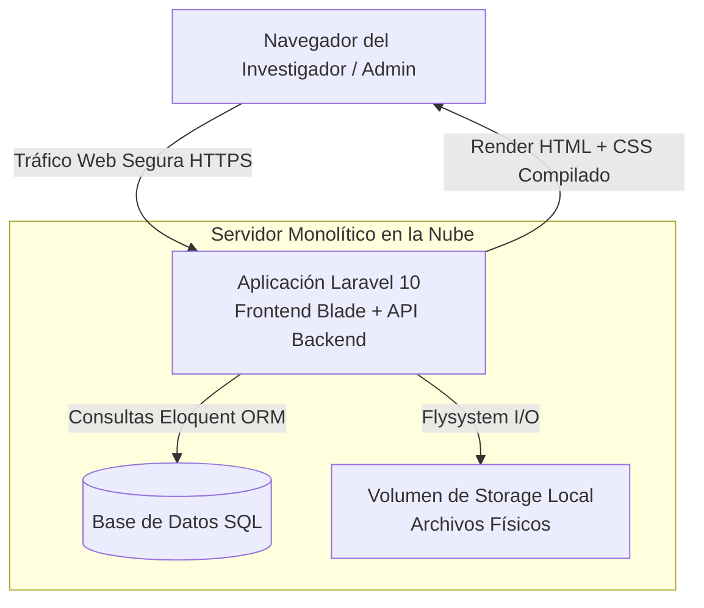
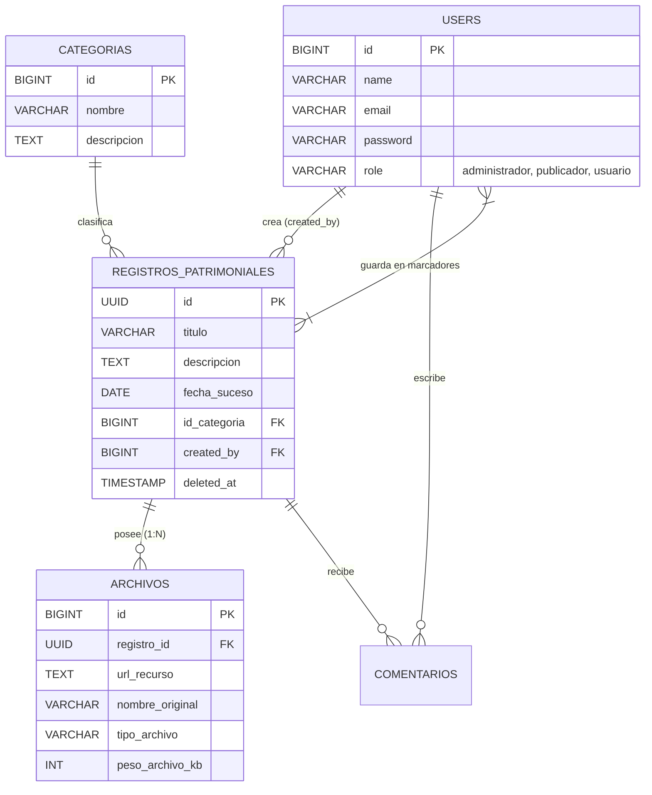
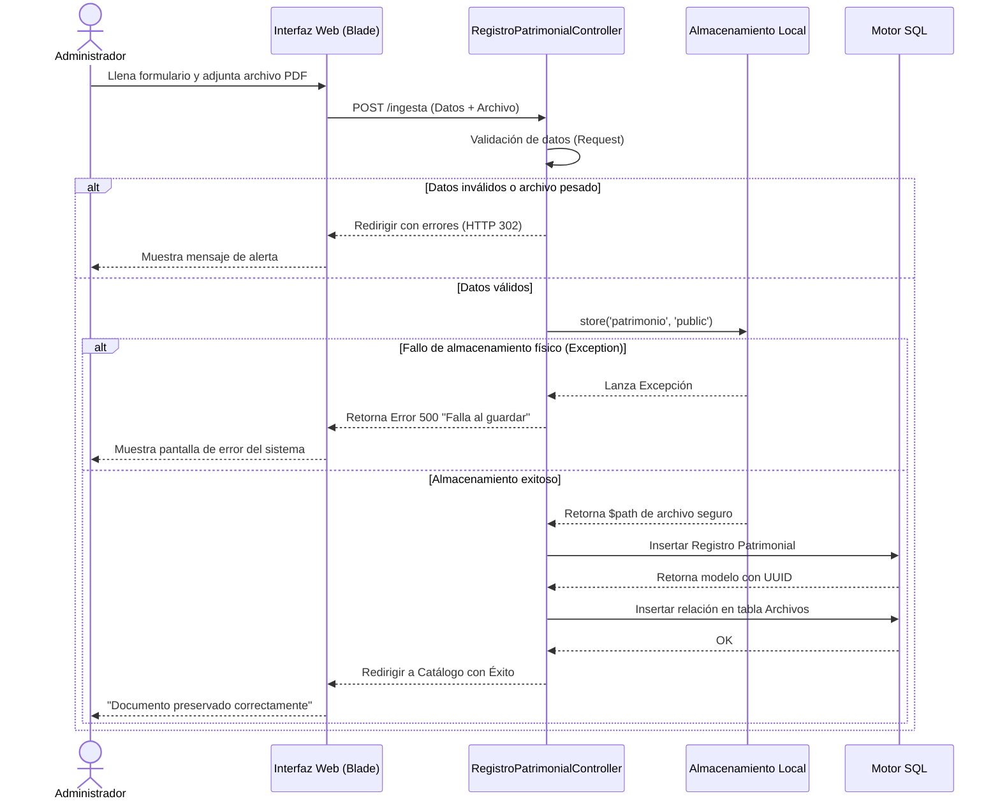
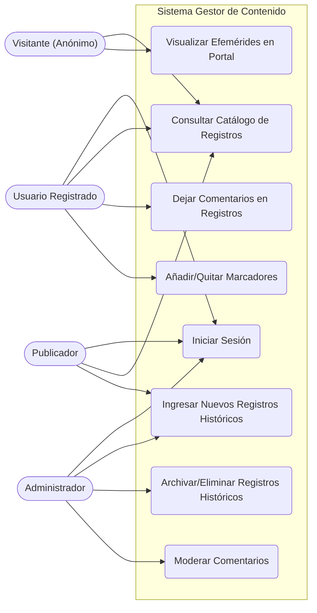
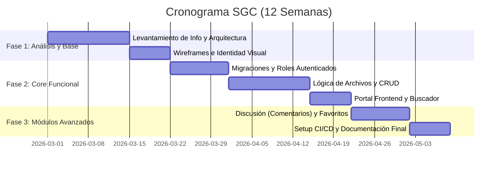

# Sistema Gestor de Contenido (SGC) - Memoria Castrense

El **SGC Memoria Castrense** es una plataforma web institucional orientada a la preservación, catalogación y discusión colaborativa de documentos históricos militares (fotografías, actas, mapas estratégicos, entre otros).

El proyecto garantiza la **Paridad de Entornos**, utiliza **Arquitectura Monolítica** en Laravel (PHP) con motor **PostgreSQL/SQLite** e implementa **Integración Continua (CI/CD)**. Todo el desarrollo se rige bajo estrictas políticas de [CONTRIBUTING.md](CONTRIBUTING.md).

---

## 🏗️ Arquitectura como Código (Doc-as-Code)

A continuación, se renderiza nativamente toda la ingeniería de software aplicada en el sistema.

### 1. Diagrama de Arquitectura de Despliegue
Implementación Monolítica escalable, eliminando dependencias de microservicios externos y utilizando el servidor nativo de persistencia de archivos de Laravel.

---

### 2. Diagrama Entidad-Relación (ER)
Arquitectura de datos que soporta trazabilidad de usuarios y múltiples archivos adjuntos por suceso histórico.

---

### 3. Diagrama de Secuencia (Ingreso de Acta Patrimonial con Manejo de Errores)
Flujo detallado demostrando el tratamiento de excepciones (bloques `alt` / `else`) durante operaciones críticas de disco.

---

### 4. Casos de Uso del Sistema
Sistema basado en permisos dinámicos y roles jerárquicos.

---

### 5. Plan de Acción y Ejecución Temporal
Visualización de los ciclos de desarrollo iterativo (Sprints).

---