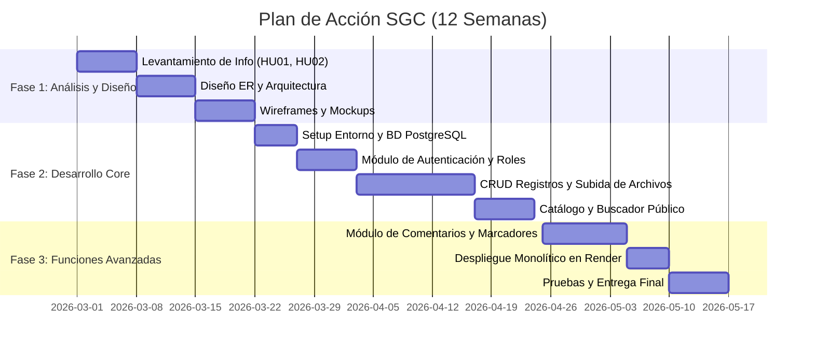
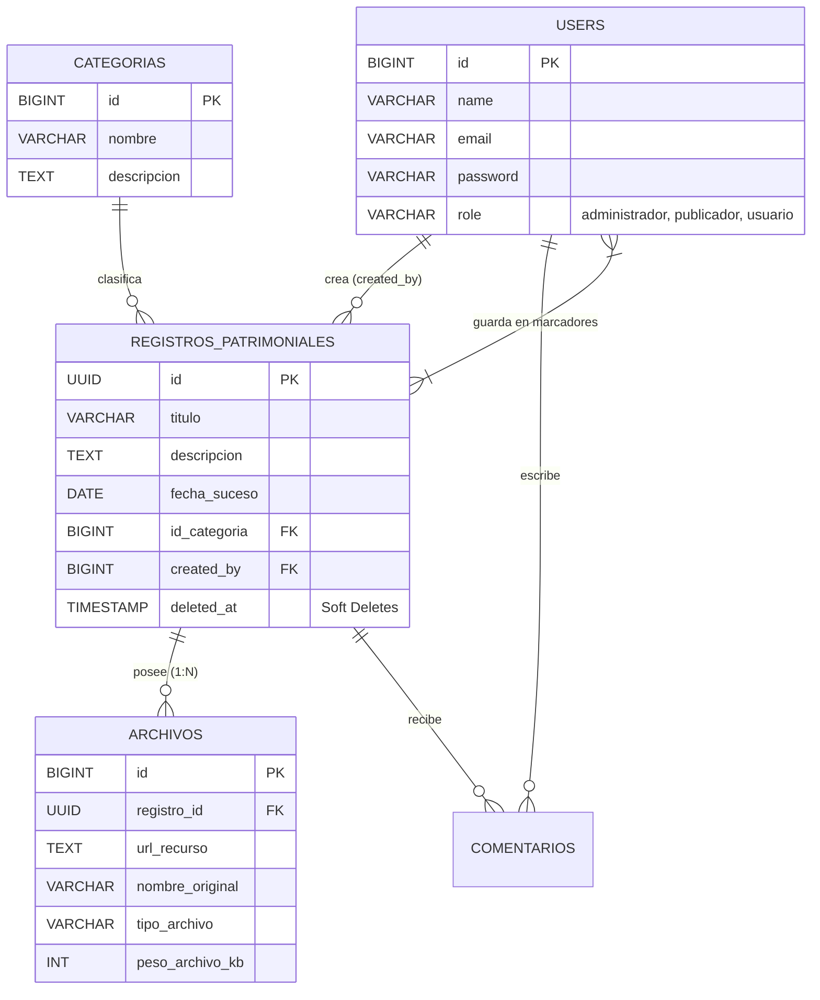
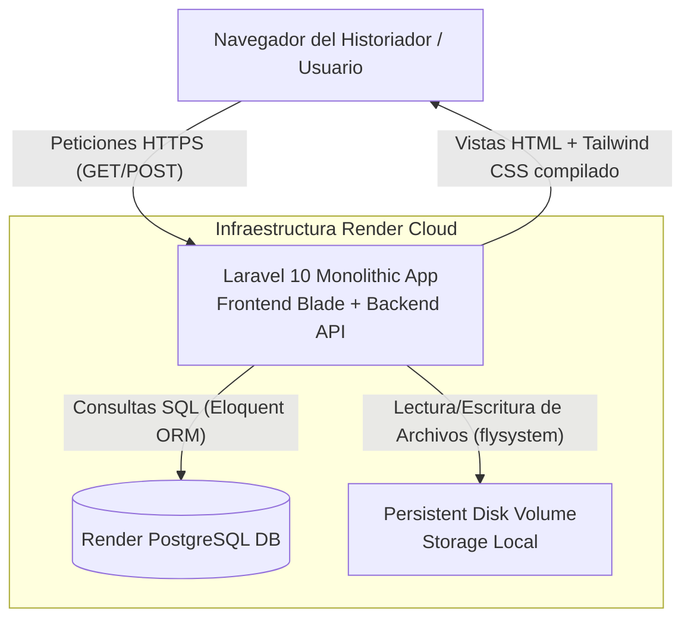
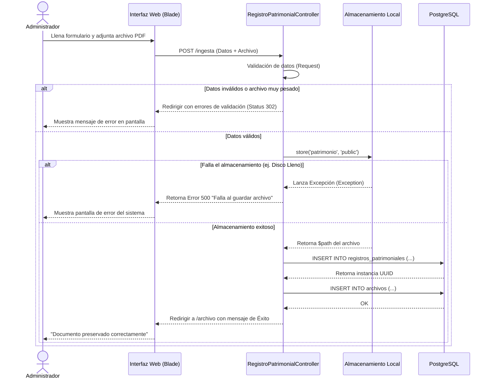

# Documentación Técnica y Metodológica - SGC Memoria Castrense

Este documento engloba la arquitectura, el análisis de requerimientos y la planificación del Sistema Gestor de Contenido (SGC) para la Preservación de la Memoria Castrense. Se atienden y subsanan todas las observaciones recibidas en la revisión del proyecto.

---

## 1. Instrumento de Elicitación (Entrevista a Informante Clave)

Para el levantamiento de información, se utilizó como instrumento la **Entrevista Semiestructurada**, aplicada al Tte. Cnel. Director del Archivo Histórico.

**Guion de Entrevista (Extracto):**
1. *¿Cómo se lleva a cabo actualmente el proceso de registro de nuevos documentos históricos?*
2. *¿Cuáles son las mayores deficiencias al intentar buscar un documento específico en sus archivos?*
3. *¿Qué roles de personal interactúan con estos documentos y qué permisos debería tener cada uno?*

**Información Obtenida (Respuestas del Informante):**
> "Actualmente todo el registro se lleva en libros contables físicos. El principal problema es el deterioro de las páginas y que, para buscar un acta de 1980, podemos tardar días leyendo tomo por tomo. Necesitamos que el sistema permita subir fotos o PDFs escaneados de estos documentos. En cuanto a roles, debe haber un Administrador que controle todo, Archivistas (Publicadores) que solo puedan subir documentos pero no borrarlos, y Usuarios que solo puedan consultar el catálogo."

---

## 2. Historias de Usuario y Reglas de Negocio

Las historias de usuario han sido refinadas para integrar las Reglas de Negocio y los Requisitos asociados.

| ID | Historia de Usuario | Reglas de Negocio (RN) | Requisitos Asignados |
|----|---------------------|-------------------------|-----------------------|
| HU01 | Como **Administrador**, quiero ingresar nuevos registros patrimoniales anexando múltiples archivos (imágenes/PDF), para digitalizar el catálogo físico. | RN1: El peso máximo total por archivo es 10MB.<br>RN2: Se debe asociar siempre a una Categoría válida. | RF01, RF02 |
| HU02 | Como **Usuario Visitante**, quiero explorar una galería pública con paginación, para encontrar actas históricas fácilmente. | RN3: El catálogo público es de solo lectura.<br>RN4: Los registros archivados no se muestran. | RF03 |
| HU03 | Como **Usuario Autenticado**, quiero dejar comentarios en los registros y marcarlos como favoritos, para mantener mis apuntes sobre el suceso. | RN5: Un usuario no puede marcar dos veces el mismo documento.<br>RN6: Los comentarios no pueden estar vacíos. | RF04, RF05 |

---

## 3. Matriz de Requisitos

### Funcionales (RF)
- **RF01:** El sistema debe permitir autenticación segura de usuarios y asignar roles (Administrador, Publicador, Usuario).
- **RF02:** El sistema debe permitir crear, leer, actualizar y "archivar" (borrado lógico) registros patrimoniales.
- **RF03:** El sistema debe proveer una barra de búsqueda para filtrar registros por título, descripción o categoría.
- **RF04:** El sistema debe permitir a los usuarios autenticados comentar sobre los registros.
- **RF05:** El sistema debe permitir almacenar documentos en marcadores personales.

### No Funcionales (RNF)
- **RNF01:** Tiempos de respuesta menores a 2 segundos para consultas de catálogo.
- **RNF02:** La interfaz debe ser completamente responsiva y mantener una estética institucional militar (Navy/Gold).
- **RNF03:** Contraseñas encriptadas con Bcrypt.

---

## 4. Plan de Acción y Diagrama de Gantt

El desarrollo está planificado para ejecutarse a lo largo de 12 semanas. Las historias de usuario (HU) determinan los sprints de desarrollo.



---

## 5. Estudio de Factibilidad

### Factibilidad Técnica y Operativa
- **Técnica:** El equipo domina el ecosistema PHP/Laravel y bases de datos relacionales. No se requieren licencias pagas al usar software Open Source.
- **Operativa:** El archivo cuenta con computadoras con navegadores web modernos, cubriendo el requerimiento mínimo para acceder a la plataforma web.

### Factibilidad Económica (Presupuesto Real)
Aunque el despliegue es "Always Free", el trabajo profesional debe ser cuantificado para reflejar el valor del sistema.

| Concepto | Costo / Honorarios Estimados (USD) |
|----------|------------------------------------|
| Honorarios Desarrollo (Eduardo & Ernesto - 3 meses) | $ 4,500.00 |
| Hosting Render & PostgreSQL (Free Tier) | $ 0.00 |
| Total del Proyecto | **$ 4,500.00** |

---

## 6. Paquete Tecnológico y Arquitectura

- **Paradigma de Programación:** Orientado a Objetos (POO).
- **Patrón de Arquitectura:** MVC (Modelo-Vista-Controlador).
- **Frontend:** Laravel Blade, Tailwind CSS y Vanilla JS.
- **Backend:** PHP 8.2 con Laravel 10.
- **Base de Datos:** PostgreSQL (Se eliminó Supabase para evitar limitaciones de conexiones concurrentes de la capa gratuita, y utilizar el flujo nativo ORM de Eloquent sobre un motor SQL limpio).
- **Almacenamiento de Archivos:** Storage local de Laravel vinculado simbólicamente, en lugar de buckets externos S3, facilitando la portabilidad y eliminando latencias de red para subir archivos.

---

## 7. Diagrama Entidad-Relación (ER)

Se corrigieron las relaciones, la trazabilidad de los usuarios y el modelo multi-archivos. Eloquent maneja con naturalidad la unión de una llave primaria BIGINT (users) como FK foránea dentro de una tabla que tiene UUID (`registros_patrimoniales`), declarando el tipo correcto (`unsignedBigInteger`).



---

## 8. Diccionario de Datos

Este diccionario coincide fielmente con las migraciones reales del código.

### Tabla: `registros_patrimoniales`
| Atributo | Tipo | Restricción | Descripción |
|----------|------|-------------|-------------|
| id | UUID | PK | Identificador único universal. |
| titulo | VARCHAR(255) | NOT NULL | Nombre del acta o suceso. |
| descripcion | TEXT | NOT NULL | Transcripción o contexto histórico. |
| fecha_suceso | DATE | NOT NULL | Fecha en que ocurrió el evento histórico. |
| id_categoria | BIGINT | FK | Relación con la tabla `categorias`. |
| created_by | BIGINT | FK, NULLABLE | ID del usuario (`users`) que ingresó el registro. |

### Tabla: `archivos` (Nueva - Soporte Multi-archivo)
| Atributo | Tipo | Restricción | Descripción |
|----------|------|-------------|-------------|
| id | BIGINT | PK | Auto-incremental. |
| registro_id | UUID | FK | Relación en cascada con `registros_patrimoniales`. |
| url_recurso | TEXT | NOT NULL | Ruta de acceso estática al archivo almacenado. |
| nombre_original | VARCHAR(255)| NOT NULL | Nombre original del archivo (ej. `acta_1980.pdf`). |
| tipo_archivo | VARCHAR(50) | NOT NULL | MIME Type (ej. `image/jpeg`). |

---

## 9. Diagrama de Arquitectura de Despliegue

Corregido para mostrar un monolito desplegado en Render (Laravel ejecuta y renderiza tanto la lógica de negocio como las vistas, no se usa Vercel).



> **Respuestas a las observaciones arquitectónicas:**
> - El navegador no habla con Vercel. Laravel, alojado en Render, compila y sirve el HTML/CSS de Blade directamente al usuario. Si apagamos el servidor de Render, la aplicación se cae por completo. 
> - Se integró la BD en un servicio separado dentro de la misma red virtual de Render Cloud.

---

## 10. Diagrama de Secuencia (Ingreso de Registro con Excepciones)

Flujo corregido con bloque alternativo (ALT) para manejar fallos.



---

## 11. Diagrama de Casos de Uso

```mermaid
usecaseDiagram
    actor "Administrador" as Admin
    actor "Publicador" as Pub
    actor "Usuario Registrado" as User
    actor "Visitante (Anónimo)" as Guest

    Guest --> (Consultar Catálogo de Registros)
    Guest --> (Visualizar Efemérides en Portal)

    User --> (Iniciar Sesión)
    User --> (Consultar Catálogo de Registros)
    User --> (Dejar Comentarios en Registros)
    User --> (Añadir/Quitar Marcadores)

    Pub --> (Iniciar Sesión)
    Pub --> (Consultar Catálogo de Registros)
    Pub --> (Ingresar Nuevos Registros Históricos)

    Admin --> (Iniciar Sesión)
    Admin --> (Ingresar Nuevos Registros Históricos)
    Admin --> (Archivar/Eliminar Registros Históricos)
    Admin --> (Moderar Comentarios)
```

---

## 12. Wireframes y Mockups

Se desarrollaron las siguientes maquetas de baja/alta fidelidad durante el diseño de las vistas de Blade:
1. **Portal (Home):** Un "Hero banner" ancho completo que detecta la efeméride del día, seguido de una cuadrícula de 4 columnas para artículos destacados, usando fondo color `navy-900` y tipografía dorada `gold-600`.
2. **Galería (Index):** Una barra lateral o superior con caja de búsqueda, y una cuadrícula responsive (`grid-cols-1 md:grid-cols-3 lg:grid-cols-4`) con las portadas de los documentos.
3. **Visor de Detalles (Show):** Diseño dividido 2/3 y 1/3. A la izquierda, el documento escaneado/PDF y su descripción. A la derecha, un feed vertical con la sección de Comentarios.
4. **Formulario de Ingesta:** Diseño centrado, con campos desplegables para la categoría y un área de arrastrar-y-soltar (drag-and-drop) para adjuntar la foto física o el PDF.

---

## 13. Retroalimentación del Avance #1

En respuesta a las correcciones dictadas, el equipo realizó los siguientes cambios estructurales:
1. **Eliminación de Vercel/Supabase:** Se consolidó todo el ecosistema en un monolito puro en Laravel desplegado en Render conectado a un motor nativo PostgreSQL.
2. **Autoría y Responsabilidad:** Se integró la columna `created_by` como clave foránea entre los registros y la tabla de usuarios, satisfaciendo la trazabilidad técnica exigida en sistemas militares.
3. **Escalabilidad de Archivos:** Se mitigó la limitación 1:1 separando los adjuntos en su propia tabla relacional (`archivos`), permitiendo que a futuro un mismo suceso histórico posea docenas de fotos de diferentes ángulos sin corromper la BD principal.
4. **Claridad Documental:** Se unificaron los estándares de nomenclatura en todos los diagramas; ahora todos los modelos y actores hablan el mismo idioma, y los flujos alternativos contemplan caídas del servidor y excepciones.
